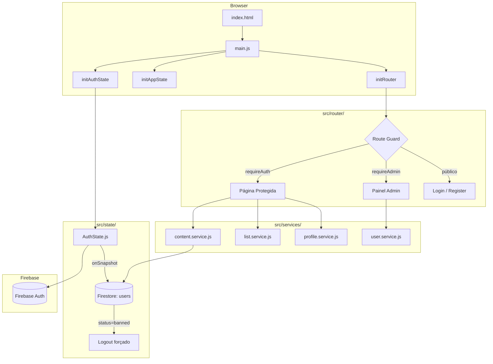

# 🐾 Petflix

> Plataforma de streaming dedicada a pets — filmes, séries e documentários selecionados para cães e gatos, com autenticação, painel admin e player integrado.

---

## 🚀 Demo

> Link de deploy via Vercel (configure suas variáveis de ambiente conforme o [guia de deploy](docs/DEPLOYMENT.md)).

---

## 📸 Screenshots

| Login                                                                                   | Dashboard                               |
| --------------------------------------------------------------------------------------- | --------------------------------------- |
| .png>) |  |

---

## 💡 Proposta

Petflix resolve um problema real para donos de pets: **entreter animais de estimação** enquanto o tutor está ocupado. A plataforma oferece um catálogo curado de vídeos do YouTube (filmes, séries e documentários) organizados por espécie (cão ou gato), com uma experiência visual inspirada em grandes serviços de streaming.

---

## ✨ Funcionalidades

- 🔐 **Autenticação completa** — cadastro, login, recuperação de senha e verificação de e-mail (Firebase Auth)
- 🐶🐱 **Seleção de perfil por espécie** — cada sessão é personalizada para cão ou gato
- 🎬 **Catálogo por categoria** — Filmes (`/filmes`), Séries (`/series`) e Documentários (`/docs`)
- ▶️ **Player integrado** — reprodução de vídeos do YouTube via rota `/player`
- ❤️ **Minha Lista** — favoritos do usuário salvos no Firestore (`/my-list`)
- 🔍 **Busca no catálogo** — busca por título e descrição via `searchContent()`
- 👤 **Gerenciamento de conta** — perfil e dados do usuário (`/conta`)
- 🛡️ **Painel Administrativo** (rota `/admin`, acesso restrito):
  - Dashboard com métricas (ApexCharts)
  - CMS de conteúdo — CRUD completo de filmes/séries/documentários
  - CRM de usuários — listagem, banimento/desbanimento e reset de senha
- ⚡ **Banimento em tempo real** — listener Firestore detecta mudança de status e desconecta o usuário instantaneamente
- 🔒 **Route guards** — `requireAuth`, `requireEmailVerified` e `requireAdmin` via middleware de rota

---

## 🛠️ Stack

| Camada           | Tecnologia            | Versão |
| ---------------- | --------------------- | ------ |
| UI Framework     | React                 | 19.x   |
| Build Tool       | Vite                  | 5.x    |
| Estilização      | Tailwind CSS          | 4.x    |
| Autenticação     | Firebase Auth         | 9.x    |
| Banco de Dados   | Firestore (NoSQL)     | 9.x    |
| Gráficos (Admin) | ApexCharts            | 5.x    |
| Deploy           | Vercel                | —      |
| Linguagem        | JavaScript ES Modules | —      |

> Sem React Router — o roteamento é implementado com um **custom router** próprio baseado em History API (`src/router/`).

---

## 🏗️ Arquitetura 

---

## 📄 Licença

[MIT](LICENSE)

---

  Feito com ❤️ para pets e seus tutores

