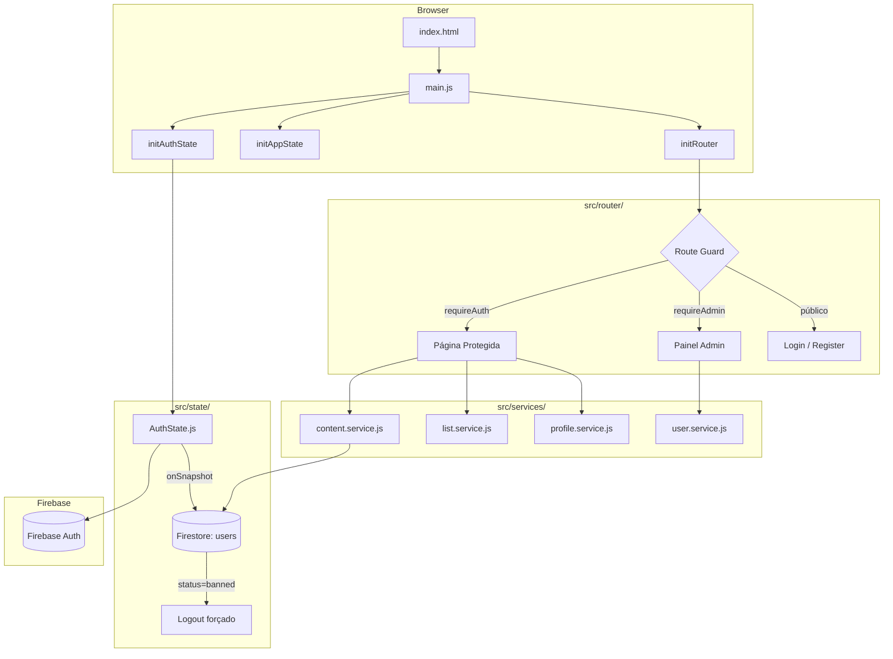

# 🐾 Petflix

> Plataforma de streaming dedicada a pets — filmes, séries e documentários selecionados para cães e gatos, com autenticação, painel admin e player integrado.

---

## 🚀 Demo

[](https://petflix.vercel.app)

> Link de deploy via Vercel (configure suas variáveis de ambiente conforme o [guia de deploy](docs/DEPLOYMENT.md)).

---

## 📸 Screenshots

| Login                                                                                   | Dashboard                               |
| --------------------------------------------------------------------------------------- | --------------------------------------- |
| .png>) |  |

---

## 💡 Proposta

Petflix resolve um problema real para donos de pets: **entreter animais de estimação** enquanto o tutor está ocupado. A plataforma oferece um catálogo curado de vídeos do YouTube (filmes, séries e documentários) organizados por espécie (cão ou gato), com uma experiência visual inspirada em grandes serviços de streaming.

---

## ✨ Funcionalidades

- 🔐 **Autenticação completa** — cadastro, login, recuperação de senha e verificação de e-mail (Firebase Auth)
- 🐶🐱 **Seleção de perfil por espécie** — cada sessão é personalizada para cão ou gato
- 🎬 **Catálogo por categoria** — Filmes (`/filmes`), Séries (`/series`) e Documentários (`/docs`)
- ▶️ **Player integrado** — reprodução de vídeos do YouTube via rota `/player`
- ❤️ **Minha Lista** — favoritos do usuário salvos no Firestore (`/my-list`)
- 🔍 **Busca no catálogo** — busca por título e descrição via `searchContent()`
- 👤 **Gerenciamento de conta** — perfil e dados do usuário (`/conta`)
- 🛡️ **Painel Administrativo** (rota `/admin`, acesso restrito):
  - Dashboard com métricas (ApexCharts)
  - CMS de conteúdo — CRUD completo de filmes/séries/documentários
  - CRM de usuários — listagem, banimento/desbanimento e reset de senha
- ⚡ **Banimento em tempo real** — listener Firestore detecta mudança de status e desconecta o usuário instantaneamente
- 🔒 **Route guards** — `requireAuth`, `requireEmailVerified` e `requireAdmin` via middleware de rota

---

## 🛠️ Stack

| Camada           | Tecnologia            | Versão |
| ---------------- | --------------------- | ------ |
| UI Framework     | React                 | 19.x   |
| Build Tool       | Vite                  | 5.x    |
| Estilização      | Tailwind CSS          | 4.x    |
| Autenticação     | Firebase Auth         | 9.x    |
| Banco de Dados   | Firestore (NoSQL)     | 9.x    |
| Gráficos (Admin) | ApexCharts            | 5.x    |
| Deploy           | Vercel                | —      |
| Linguagem        | JavaScript ES Modules | —      |

> Sem React Router — o roteamento é implementado com um **custom router** próprio baseado em History API (`src/router/`).

---

## ⚙️ Como Rodar Localmente

### Pré-requisitos

- Node.js >= 18
- npm >= 9
- Projeto Firebase configurado (Auth + Firestore)

### 1. Clone e instale

```bash
git clone https://github.com/moaaskt/petflix.git
cd petflix
npm install
```

### 2. Configure as variáveis de ambiente

```bash
cp .env.example .env
```

Edite `.env` com suas credenciais do Firebase:

```env
VITE_FIREBASE_API_KEY=sua_api_key
VITE_FIREBASE_AUTH_DOMAIN=seu-projeto.firebaseapp.com
VITE_FIREBASE_PROJECT_ID=seu-projeto-id
VITE_FIREBASE_STORAGE_BUCKET=seu-projeto.appspot.com
VITE_FIREBASE_MESSAGING_SENDER_ID=000000000000
VITE_FIREBASE_APP_ID=1:000000000000:web:xxxxxxxxxxxx
```

> 🔐 **Nunca commite o arquivo `.env`** — ele já está no `.gitignore`.
> Como obter as credenciais: [docs/SETUP.md](docs/SETUP.md)

### 3. Execute

| Comando           | Descrição                              |
| ----------------- | -------------------------------------- |
| `npm run dev`     | Servidor de desenvolvimento (Vite HMR) |
| `npm run build`   | Build de produção em `dist/`           |
| `npm run preview` | Preview local do build de produção     |

Acesse: `http://localhost:5173`

---

## 🏗️ Arquitetura (Alto Nível)



---

## 📁 Estrutura de Pastas

```
petflix/
├── public/
│   └── assets/               # Imagens, thumbnails e assets estáticos
├── src/
│   ├── main.js               # Ponto de entrada da SPA
│   ├── style.css             # CSS global
│   ├── config/
│   │   ├── firebase.js       # Inicialização e validação do Firebase
│   │   └── constants.js      # Constantes globais (tipos, chaves de storage)
│   ├── router/
│   │   ├── index.js          # Lógica do custom router
│   │   ├── routes.js         # Definição de rotas e middlewares (guards)
│   │   └── navigator.js      # Helper de navegação programática
│   ├── state/
│   │   ├── AuthState.js      # Estado global de autenticação + ban listener
│   │   └── AppState.js       # Estado global da aplicação (tema, perfil)
│   ├── pages/
│   │   ├── LoginPage.js
│   │   ├── RegisterPage.js
│   │   ├── ForgotPasswordPage.js
│   │   ├── ProfilePage.js
│   │   ├── MyListPage.js
│   │   ├── home/             # Seleção de perfil (quem está assistindo?)
│   │   ├── dashboard/        # Catálogo principal
│   │   ├── movies/           # Página de filmes
│   │   ├── categories/       # Séries e Documentários
│   │   ├── player/           # Player de vídeo
│   │   ├── account/          # Minha Conta
│   │   └── admin/
│   │       ├── AdminDashboardPage.js   # Métricas (ApexCharts)
│   │       ├── AdminMoviesPage.js      # CMS de conteúdo
│   │       └── AdminUsersPage.js       # CRM de usuários
│   ├── components/
│   │   ├── HeroFeatured.jsx          # Banner hero com carrossel
│   │   ├── ContentCard.jsx           # Card de conteúdo
│   │   ├── ContentRail.jsx           # Linha horizontal de cards
│   │   ├── admin/                    # Componentes do painel admin
│   │   ├── features/                 # Componentes de feature (search, favorites…)
│   │   ├── layout/                   # Navbar, Sidebar, Footer
│   │   └── ui/                       # Botões, modais, toasts, spinners
│   ├── services/
│   │   ├── content.service.js        # CRUD do catálogo (Firestore: 'content')
│   │   ├── list.service.js           # Minha Lista (favoritos)
│   │   ├── profile.service.js        # Gerenciamento de perfis
│   │   ├── user.service.js           # Dados do usuário (role, status)
│   │   ├── youtube.service.js        # Integração YouTube
│   │   ├── auth/                     # auth.service.js
│   │   ├── api/                      # Wrappers de baixo nível
│   │   ├── banner/                   # Serviço de banner/hero
│   │   └── storage/                  # Firebase Storage helpers
│   ├── hooks/                        # Custom hooks React
│   ├── utils/
│   │   ├── seed-db.js                # Seed inicial do Firestore
│   │   ├── seed-content.js           # Seed de conteúdo curado
│   │   ├── make-admin.js             # Utilitário para promover admin
│   │   ├── toast.js                  # Sistema de notificações
│   │   └── GlobalErrorHandler.js     # Handler global de erros
│   ├── data/                         # Dados estáticos / mocks locais
│   └── styles/                       # CSS modular por componente
├── index.html                        # HTML shell da SPA
├── vite.config.js                    # Configuração do Vite
├── tailwind.config.js                # Configuração do Tailwind
├── postcss.config.js                 # PostCSS (autoprefixer)
├── vercel.json                       # Config de deploy + headers de segurança
├── .env.example                      # Template de variáveis de ambiente
└── .eslintrc.js / .prettierrc        # Configurações de qualidade de código
```

---

## 🔥 Firebase & Firestore

Veja o schema completo e o fluxo de autenticação em [docs/ARCHITECTURE.md](docs/ARCHITECTURE.md).

### Coleções principais

| Coleção                | Descrição                                                                                    |
| ---------------------- | -------------------------------------------------------------------------------------------- |
| `users`                | Dados da conta: `uid`, `email`, `role`, `status`, `createdAt`                                |
| `users/{uid}/profiles` | Subcoleção: perfis de visualização (`name`, `species`, `avatar`)                             |
| `content`              | Catálogo: `title`, `type`, `species`, `genre`, `videoId`, `featured`, `trending`, `original` |

### Autenticação

- Provedor: **Email/Senha** (Firebase Auth)
- Persistência: `browserLocalPersistence` (`src/config/firebase.js`)
- Verificação de e-mail obrigatória para acessar o catálogo
- Banimento em tempo real via `onSnapshot` em `users/{uid}` (`src/state/AuthState.js`)

---

## ✅ Boas Práticas

- **Lint**: ESLint configurado em `.eslintrc.js`
- **Formatação**: Prettier configurado em `.prettierrc`
- **EditorConfig**: `.editorconfig` para consistência entre editores
- **Separação de responsabilidades**: componentes não importam Firebase diretamente — tudo passa por `src/services/`
- **Cache de leitura**: `content.service.js` implementa cache em memória para evitar leituras redundantes do Firestore
- **Validação de ambiente**: `src/config/firebase.js` valida todas as variáveis obrigatórias e lança erro descritivo se faltarem
- **Segurança**: `vercel.json` define headers `X-Content-Type-Options`, `X-Frame-Options` e `X-XSS-Protection`

---

## 🗺️ Roadmap (sugestões)

- [ ] Testes automatizados (Vitest + Testing Library)
- [ ] PWA com suporte offline
- [ ] Busca global com debounce na navbar
- [ ] Sistema de recomendação baseado no histórico do pet
- [ ] Notificações push para novos conteúdos
- [ ] Suporte a múltiplos perfis por conta com avatar personalizado
- [ ] i18n (internacionalização)

---

## 📄 Licença

[MIT](LICENSE)

---

<p align="center">
  Feito com ❤️ para pets e seus tutores
</p>
