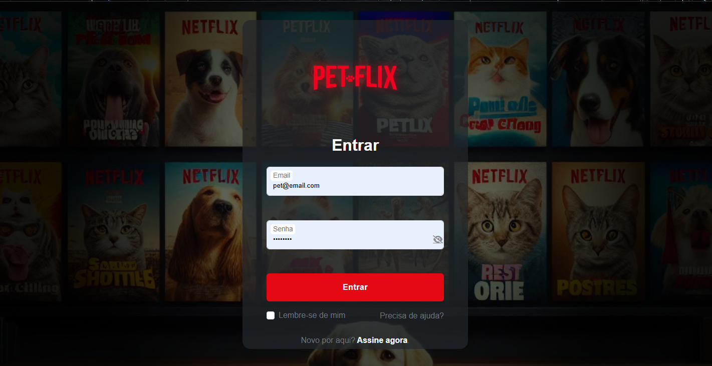

# 🐾 Petflix

<p align="center">
  
</p>

<p align="center">
  <strong>🎥 Streaming feito especialmente para seus pets relaxarem, brincarem ou simplesmente curtirem o momento!</strong>
</p>

---

## 📋 Sumário

- [Visão Geral do Projeto](#-visão-geral-do-projeto)
- [Stack Tecnológica](#-stack-tecnológica)
- [Arquitetura / Estrutura do Projeto](#-arquitetura--estrutura-do-projeto)
- [Funcionamento](#-funcionamento)
- [Guia de Instalação e Execução Local](#-guia-de-instalação-e-execução-local)
- [Guia de Deploy](#-guia-de-deploy)
- [Documentação Técnica dos Arquivos JS](#-documentação-técnica-dos-arquivos-js)
- [Guia de Contribuição](#-guia-de-contribuição)
- [Roadmap](#-roadmap)
- [Extras](#-extras)

---

## 🎯 Visão Geral do Projeto

### O que é o Petflix

**Petflix** é uma aplicação web de streaming voltada para **animais de estimação** (principalmente cães e gatos). A plataforma oferece uma experiência similar ao Netflix, mas com conteúdo especialmente selecionado para entreter e relaxar pets enquanto seus tutores não estão em casa.

### Objetivo da Aplicação

O objetivo principal do Petflix é proporcionar um ambiente digital seguro e divertido onde pets possam assistir vídeos adequados para sua espécie. A aplicação utiliza a **API do YouTube** para buscar e exibir vídeos relacionados a cães e gatos, organizados em categorias como filmes, séries e documentários.

### Para quem foi criado

- **Tutores de pets** que querem entreter seus animais durante ausências
- **Pessoas interessadas em conteúdo sobre animais de estimação**
- **Desenvolvedores** que desejam entender integração com Firebase e YouTube API
- **Estudantes** de desenvolvimento web procurando exemplos práticos

---

## 🛠️ Stack Tecnológica

### Frontend

- **HTML5**: Estrutura semântica das páginas
- **CSS3**: Estilização e responsividade
  - **Bootstrap 5.3.2**: Framework CSS para componentes e grid system
  - **Font Awesome 6.4.2/6.5.0**: Ícones vetoriais
  - **Google Fonts (Montserrat, Open Sans)**: Tipografia customizada

### Backend / Serviços

- **JavaScript (ES6+)**: Lógica de negócio e interatividade
- **Firebase 9.6.0 (Compat Mode)**:
  - **Firebase Authentication**: Autenticação de usuários (email/senha)
  - **Firebase Realtime Database**: Armazenamento de dados do usuário
- **YouTube Data API v3**: Busca e exibição de vídeos
- **YouTube IFrame API**: Player de vídeos embutido

### Por que cada tecnologia é usada

| Tecnologia | Motivo |
|------------|--------|
| **HTML5** | Base semântica e acessível para estruturação |
| **CSS3 + Bootstrap** | Desenvolvimento rápido de UI responsiva e moderna |
| **Firebase Auth** | Autenticação segura sem necessidade de backend próprio |
| **Firebase Realtime Database** | Armazenamento em tempo real de dados do usuário |
| **YouTube API** | Acesso a vasta biblioteca de vídeos sobre pets |
| **JavaScript Vanilla** | Controle total sobre a lógica sem dependências pesadas |

---

## 📁 Arquitetura / Estrutura do Projeto

### Árvore de Diretórios

```
petflix/
├── assets/                          # Imagens, vídeos e recursos visuais
│   ├── *.jpg, *.png, *.webp        # Imagens de capas e thumbnails
│   ├── *.mp4                        # Vídeos locais (se houver)
│   └── petflix-logo_prev_ui.png    # Logo principal
│
├── css/                             # Folhas de estilo
│   ├── style.css                    # Estilos globais
│   ├── style-filmes.css             # Estilos para páginas de filmes
│   ├── login-prin.css               # Estilos da página de login
│   ├── register.css                 # Estilos da página de cadastro
│   ├── indexcach.css                # Estilos para página de cachorros
│   ├── indexgat.css                 # Estilos para página de gatos
│   ├── series.css                   # Estilos para páginas de séries
│   ├── films.css                    # Estilos específicos de filmes
│   ├── doc.css                      # Estilos para documentários
│   ├── sobre.css                    # Estilos da página "Sobre Nós"
│   ├── contato.css                  # Estilos da página de contato
│   ├── login.css                    # Estilos alternativos de login
│   └── style-wait.css               # Estilos da tela de loading
│
├── JS/                              # Scripts JavaScript
│   ├── firebase-config.js           # Configuração base do Firebase
│   ├── firebase-config.local.js     # Config local (não versionado)
│   ├── firebase-config.netlify.js   # Config para deploy Netlify
│   ├── firebase-config.local.example.js  # Exemplo de config
│   ├── firebase-auth.js             # Funções de autenticação
│   ├── index.js                     # Lógica da página de login
│   ├── register.js                  # Lógica do cadastro
│   ├── youtube-api.js               # Integração com YouTube Data API
│   ├── youtube-render.js            # Renderização de vídeos do YouTube
│   ├── loading.js                   # Loading para gatos
│   ├── loadingDog.js                # Loading para cachorros
│   ├── auth.js                      # Autenticação alternativa (legado)
│   ├── films-api.js                 # API de filmes (vazio)
│   ├── series-api.js                # API de séries (parcial)
│   ├── docs-api.js                  # API de documentários (parcial)
│   └── java.js                      # Scripts auxiliares
│
├── pagesFooter/                     # Páginas do rodapé
│   ├── sobrenos.html                # Página "Sobre Nós"
│   ├── contato.html                 # Página de contato
│   ├── termos-uso.html              # Termos de uso
│   └── politica-privacidade.html    # Política de privacidade
│
├── index.html                       # Página de login principal
├── register.html                    # Página de cadastro
├── home.html                        # Página de seleção de perfil (Cachorro/Gato)
├── indexcach.html                   # Página principal para cachorros
├── indexgato.html                   # Página principal para gatos
├── filmes.html                      # Página de filmes (cachorros)
├── filmescat.html                   # Página de filmes (gatos)
├── series.html                      # Página de séries (cachorros)
├── seriescats.html                  # Página de séries (gatos)
├── docs.html                        # Página de documentários (cachorros)
├── docscats.html                    # Página de documentários (gatos)
├── wait.html                        # Tela de loading (cachorros)
├── waitgato.html                    # Tela de loading (gatos)
└── README.md                        # Este arquivo
```

### Propósito de Cada Pasta e Arquivo Importante

#### `/assets`
Armazena todos os recursos visuais: logos, imagens de capa, thumbnails de vídeos e vídeos locais (se houver).

#### `/css`
Organiza os estilos por funcionalidade. Cada página tem seu CSS específico, facilitando manutenção.

#### `/JS`
Contém toda a lógica JavaScript:
- **firebase-config.js**: Configuração centralizada do Firebase
- **firebase-auth.js**: Gerencia autenticação e proteção de rotas
- **youtube-api.js**: Busca vídeos na API do YouTube
- **youtube-render.js**: Renderiza vídeos e grids na interface

#### `/pagesFooter`
Páginas informativas e legais do site.

#### Arquivos HTML Principais
- **index.html**: Ponto de entrada (login)
- **home.html**: Seleção de perfil (Cachorro/Gato)
- **indexcach.html / indexgato.html**: Dashboards específicos por espécie
- **filmes.html / series.html / docs.html**: Categorias de conteúdo

---

## ⚙️ Funcionamento

### Fluxo Principal da Aplicação

```
1. Login (index.html)
   ↓
2. Seleção de Perfil (home.html)
   ↓
3. Dashboard Específico (indexcach.html ou indexgato.html)
   ↓
4. Navegação por Categorias (filmes, séries, documentários)
   ↓
5. Reprodução de Vídeo (modal ou iframe)
```

### Como as Páginas Funcionam

#### 1. **Página de Login (`index.html`)**
- Formulário de autenticação com Firebase
- Validação de email e senha
- Recuperação de senha
- Redirecionamento para `home.html` após login bem-sucedido

#### 2. **Seleção de Perfil (`home.html`)**
- Exibe dois perfis: "Cachorro" e "Gato"
- Ao clicar, redireciona para o dashboard correspondente
- Protegida por autenticação (verifica se usuário está logado)

#### 3. **Dashboards (`indexcach.html` / `indexgato.html`)**
- Integração com YouTube API para buscar vídeos
- Exibição de vídeos em grid com busca customizável
- Player de vídeo embutido
- Navegação para categorias (filmes, séries, documentários)

#### 4. **Páginas de Categorias**
- **Filmes**: Carrosséis com filmes clássicos, aventuras e comédias
- **Séries**: Séries populares, educativas e para filhotes
- **Documentários**: Sobre raças, comportamento e saúde

#### 5. **Reprodução de Vídeo**
- Modal com iframe do YouTube
- Autoplay ao abrir
- Controles do YouTube nativos

### Como os Scripts JS se Conectam

#### Inicialização do Firebase
```javascript
// 1. Carrega SDKs do Firebase (CDN)
// 2. Detecta ambiente (Netlify ou local)
// 3. Carrega config apropriada (firebase-config.netlify.js ou .local.js)
// 4. Inicializa app, auth e database
// 5. Expõe no window.auth e window.db
```

#### Fluxo de Autenticação
```javascript
// firebase-auth.js
// - Verifica estado de autenticação
// - Protege rotas automaticamente
// - Gerencia logout

// index.js (login)
// - Captura formulário
// - Valida credenciais
// - Chama auth.signInWithEmailAndPassword()
// - Redireciona se sucesso
```

#### Integração YouTube
```javascript
// youtube-api.js
// - Função searchVideos() busca na API
// - Retorna lista de vídeos formatados

// youtube-render.js
// - renderPlayer(): Exibe iframe do vídeo
// - renderGrid(): Cria grid de thumbnails
// - renderPagination(): Botões de navegação

// Uso nas páginas:
// 1. Busca vídeos com termo (ex: "cachorros")
// 2. Renderiza grid
// 3. Ao clicar, renderiza player
```

### Fluxos Principais

#### Fluxo de Login
1. Usuário preenche email/senha
2. `index.js` valida e chama Firebase Auth
3. Firebase verifica credenciais
4. Se válido, redireciona para `home.html`
5. `home.html` verifica autenticação via `firebase-auth.js`

#### Fluxo de Navegação
1. Usuário seleciona perfil (Cachorro/Gato)
2. Redireciona para dashboard específico
3. Dashboard carrega vídeos via YouTube API
4. Usuário navega por categorias
5. Ao clicar em vídeo, abre modal com player

#### Fluxo de Proteção de Rotas
1. `firebase-auth.js` escuta mudanças de autenticação
2. Lista de páginas protegidas: `["indexcach.html", "indexgato.html", "filmes.html", "series.html"]`
3. Se não autenticado e em página protegida, redireciona para `index.html`

---

## 🚀 Guia de Instalação e Execução Local

### Requisitos

- **Navegador moderno** (Chrome, Firefox, Edge, Safari)
- **Servidor HTTP local** (opcional, mas recomendado)
- **Conta Firebase** (para autenticação)
- **Chave da API do YouTube** (opcional, para busca dinâmica)

### Passo a Passo

#### 1. Clone o Repositório
```bash
git clone https://github.com/seu-usuario/petflix.git
cd petflix
```

#### 2. Configure o Firebase

1. Acesse [Firebase Console](https://console.firebase.google.com/)
2. Crie um novo projeto ou use existente
3. Ative **Authentication** (Email/Password)
4. Ative **Realtime Database**
5. Copie as credenciais do projeto

#### 3. Configure as Credenciais

**Opção A: Arquivo Local (Recomendado para desenvolvimento)**
```bash
# Copie o arquivo de exemplo
cp JS/firebase-config.local.example.js JS/firebase-config.local.js

# Edite JS/firebase-config.local.js e preencha suas credenciais
```

**Opção B: Variáveis Globais (Alternativa)**
Edite `JS/firebase-config.js` e adicione suas credenciais diretamente (não recomendado para produção).

#### 4. Configure YouTube API (Opcional)

1. Acesse [Google Cloud Console](https://console.cloud.google.com/)
2. Crie um projeto ou selecione existente
3. Ative **YouTube Data API v3**
4. Crie uma chave de API
5. Adicione a chave em `JS/firebase-config.local.js`:
```javascript
window.__PETFLIX_KEYS = {
  youtube: {
    apiKey: "SUA_CHAVE_AQUI"
  }
};
```

#### 5. Execute o Projeto

**Opção A: Servidor HTTP Local (Recomendado)**

**Python 3:**
```bash
python -m http.server 8000
```

**Node.js (http-server):**
```bash
npx http-server -p 8000
```

**PHP:**
```bash
php -S localhost:8000
```

**Opção B: Abrir Diretamente**
Abra `index.html` no navegador (algumas funcionalidades podem não funcionar devido a CORS).

#### 6. Acesse a Aplicação

Abra o navegador e acesse:
```
http://localhost:8000
```

#### 7. Criar Conta de Teste

1. Clique em "Cadastre-se agora"
2. Preencha nome, email e senha (mínimo 6 caracteres)
3. Verifique o email de confirmação
4. Faça login com as credenciais criadas

### Credenciais de Demonstração

Se houver uma conta de teste configurada:
- **Email:** `pet@email.com`
- **Senha:** `senha123`

---

## 📦 Guia de Deploy

### GitHub Pages

#### 1. Preparação
```bash
# Certifique-se de que o repositório está no GitHub
git add .
git commit -m "Preparando para deploy"
git push origin main
```

#### 2. Configuração no GitHub
1. Vá em **Settings** > **Pages**
2. Selecione a branch `main` (ou `master`)
3. Selecione a pasta `/root`
4. Salve

#### 3. Ajuste de Configuração
Para GitHub Pages, você precisará:
- Usar `firebase-config.netlify.js` ou criar `firebase-config.github.js`
- Ajustar caminhos relativos se necessário

#### 4. Acesse
```
https://seu-usuario.github.io/petflix/
```

### Netlify

#### 1. Preparação
```bash
# Crie um arquivo netlify.toml (opcional)
echo '[[redirects]]
  from = "/*"
  to = "/index.html"
  status = 200' > netlify.toml
```

#### 2. Deploy via Netlify CLI
```bash
npm install -g netlify-cli
netlify login
netlify deploy --prod
```

#### 3. Deploy via Interface Web
1. Acesse [Netlify](https://www.netlify.com/)
2. Arraste a pasta do projeto ou conecte ao GitHub
3. Configure variáveis de ambiente (se necessário)
4. Deploy automático

#### 4. Configuração de Variáveis
No Netlify, adicione variáveis de ambiente:
- `FIREBASE_API_KEY`
- `FIREBASE_AUTH_DOMAIN`
- etc.

E ajuste `firebase-config.netlify.js` para ler essas variáveis.

### Vercel

#### 1. Instalação do CLI
```bash
npm install -g vercel
```

#### 2. Deploy
```bash
vercel
```

#### 3. Configuração
Siga as instruções do CLI para configurar o projeto.

### Firebase Hosting

#### 1. Instalação do Firebase CLI
```bash
npm install -g firebase-tools
firebase login
```

#### 2. Inicialização
```bash
firebase init hosting
```

#### 3. Configuração
- Selecione o projeto Firebase
- Defina `public` como diretório de build (ou `.` se for o root)
- Configure como SPA (Single Page Application)

#### 4. Deploy
```bash
firebase deploy --only hosting
```

---

## 📚 Documentação Técnica dos Arquivos JS

### `firebase-config.js`

**Propósito:** Inicializa o Firebase e expõe instâncias globais.

**Funções/Variáveis:**
- `window.firebaseApp`: Instância do app Firebase
- `window.auth`: Instância do Firebase Auth
- `window.db`: Instância do Realtime Database
- `window._petflixFirebaseReady`: Flag de inicialização

**Como funciona:**
1. Verifica se já foi inicializado
2. Lê configuração de `window.__FIREBASE_CONFIG__` ou `window.__PETFLIX_KEYS.firebase`
3. Inicializa Firebase se ainda não foi
4. Expõe `auth` e `db` no `window`

**Onde é usado:** Carregado em todas as páginas que precisam de Firebase.

---

### `firebase-auth.js`

**Propósito:** Gerencia autenticação e proteção de rotas.

**Funções:**

#### `checkAuth(requireAuth, requireEmailVerified)`
- **Parâmetros:**
  - `requireAuth` (boolean): Se true, exige usuário autenticado
  - `requireEmailVerified` (boolean): Se true, exige email verificado
- **Retorno:** Promise que resolve com o usuário ou rejeita com erro
- **O que faz:** Verifica estado de autenticação e redireciona se necessário
- **Onde é usado:** Páginas protegidas

#### `logout()`
- **Parâmetros:** Nenhum
- **Retorno:** Promise
- **O que faz:** Desloga o usuário e redireciona para login
- **Onde é usado:** Botões de logout nas páginas

**Variáveis:**
- `__PETFLIX_PROTECTED_PAGES__`: Array com páginas que exigem autenticação

**Onde é usado:** Todas as páginas protegidas (indexcach.html, indexgato.html, etc.)

---

### `index.js`

**Propósito:** Lógica da página de login.

**Funções:**

#### `showError(message)`
- **Parâmetros:** `message` (string)
- **Retorno:** void
- **O que faz:** Exibe mensagem de erro no topo da página
- **Onde é usado:** Tratamento de erros de login

#### `showSuccess(message)`
- **Parâmetros:** `message` (string)
- **Retorno:** void
- **O que faz:** Exibe mensagem de sucesso
- **Onde é usado:** Confirmação de ações bem-sucedidas

#### `dismissAlert(id)`
- **Parâmetros:** `id` (string) - ID do elemento alert
- **Retorno:** void
- **O que faz:** Esconde o alerta
- **Onde é usado:** Botões de fechar nos alertas

**Event Listeners:**
- Formulário de login: Submete credenciais ao Firebase
- Botão "Esqueceu a senha": Envia email de recuperação
- Toggle de senha: Mostra/oculta senha

**Onde é usado:** `index.html`

---

### `register.js`

**Propósito:** Lógica da página de cadastro.

**Funções:**

#### `resendVerificationEmail(email)`
- **Parâmetros:** `email` (string)
- **Retorno:** Promise
- **O que faz:** Reenvia email de verificação
- **Onde é usado:** Link "Reenviar" na mensagem de sucesso

#### `handleRegisterError(error)`
- **Parâmetros:** `error` (FirebaseError)
- **Retorno:** void
- **O que faz:** Traduz códigos de erro do Firebase para mensagens amigáveis
- **Onde é usado:** Catch do cadastro

#### `showError(message)` / `showSuccess(message)` / `hideAllMessages()`
- Similar a `index.js`, mas específico para a página de cadastro

**Event Listeners:**
- Formulário de cadastro: Cria usuário, envia verificação, salva dados no Realtime Database

**Onde é usado:** `register.html`

---

### `youtube-api.js`

**Propósito:** Integração com YouTube Data API v3.

**Funções:**

#### `getYoutubeKey()`
- **Parâmetros:** Nenhum
- **Retorno:** string (chave da API) ou string vazia
- **O que faz:** Lê chave da API de `window.__PETFLIX_KEYS.youtube.apiKey`
- **Onde é usado:** Antes de fazer requisições à API

#### `searchVideos({ q, maxResults, pageToken })`
- **Parâmetros:**
  - `q` (string): Termo de busca
  - `maxResults` (number, padrão: 12): Quantidade de resultados
  - `pageToken` (string, padrão: ""): Token de paginação
- **Retorno:** Promise que resolve com objeto:
  ```javascript
  {
    items: [
      {
        id: string,        // ID do vídeo
        title: string,     // Título
        channelTitle: string, // Canal
        thumb: { url: string } // Thumbnail
      }
    ],
    nextPageToken: string,
    prevPageToken: string
  }
  ```
- **O que faz:** Busca vídeos no YouTube com filtros de segurança (safeSearch, embeddable)
- **Onde é usado:** Páginas que exibem vídeos (indexcach.html, indexgato.html)

---

### `youtube-render.js`

**Propósito:** Renderização de vídeos e grids na interface.

**Funções:**

#### `renderPlayer(el, videoId)`
- **Parâmetros:**
  - `el` (HTMLElement): Elemento onde renderizar o player
  - `videoId` (string): ID do vídeo do YouTube
- **Retorno:** void
- **O que faz:** Insere iframe do YouTube no elemento com autoplay
- **Onde é usado:** Ao clicar em um vídeo no grid

#### `renderGrid(el, items, onClick)`
- **Parâmetros:**
  - `el` (HTMLElement): Container do grid
  - `items` (Array): Lista de vídeos (formato do `searchVideos`)
  - `onClick` (function): Callback ao clicar em um item
- **Retorno:** void
- **O que faz:** Cria grid de cards com thumbnails e títulos
- **Onde é usado:** Exibição de resultados de busca

#### `renderPagination(el, { onPrev, onNext, hasPrev, hasNext })`
- **Parâmetros:**
  - `el` (HTMLElement): Container da paginação
  - `onPrev` (function): Callback do botão anterior
  - `onNext` (function): Callback do botão próximo
  - `hasPrev` (boolean): Se há página anterior
  - `hasNext` (boolean): Se há próxima página
- **Retorno:** void
- **O que faz:** Renderiza botões de navegação de páginas
- **Onde é usado:** Grids com muitos resultados

**Onde é usado:** `indexcach.html`, `indexgato.html`

---

### `loading.js` / `loadingDog.js`

**Propósito:** Animações de loading personalizadas.

**Funções:**

#### `showLoading(message)`
- **Parâmetros:** `message` (string, padrão: "Carregando...")
- **Retorno:** void
- **O que faz:** Exibe overlay de loading com animação (gato ou cachorro)
- **Onde é usado:** Início do carregamento da página

#### `hideLoading()`
- **Parâmetros:** Nenhum
- **Retorno:** void
- **O que faz:** Remove overlay de loading com fade-out
- **Onde é usado:** Após carregamento completo

#### `initPageLoading()`
- **Parâmetros:** Nenhum
- **Retorno:** void
- **O que faz:** Inicializa loading automático na página
- **Onde é usado:** `DOMContentLoaded`

**Diferenças:**
- `loading.js`: Ícone de gato, cor vermelha (#e50914)
- `loadingDog.js`: Ícone de cachorro, cor laranja (#e67e22)

**Onde é usado:** Páginas de conteúdo (filmes.html, series.html, etc.)

---

### `auth.js` (Legado)

**Propósito:** Autenticação alternativa (não usa Firebase).

**Status:** Parece ser código legado que não é mais usado, pois o projeto migrou para Firebase Auth.

**Onde é usado:** Possivelmente não é mais referenciado.

---

### `films-api.js` / `series-api.js` / `docs-api.js`

**Status:** Arquivos parcialmente implementados ou vazios.

**Observação:** A lógica de filmes, séries e documentários está principalmente inline nos arquivos HTML correspondentes, não nestes módulos separados.

**Sugestão:** Refatorar para mover a lógica para estes arquivos.

---

## 🤝 Guia de Contribuição

### Como Organizar Código

#### Estrutura de Arquivos
- Mantenha HTML, CSS e JS separados
- Use nomes descritivos e consistentes
- Agrupe por funcionalidade, não por tipo

#### Convenções de Nomenclatura
- **Arquivos:** kebab-case (`firebase-config.js`, `indexcach.html`)
- **Variáveis/Funções:** camelCase (`searchVideos`, `renderPlayer`)
- **Constantes:** UPPER_SNAKE_CASE (`__PETFLIX_PROTECTED_PAGES__`)
- **Classes CSS:** kebab-case (`.navbar-petflix`, `.hero-section`)

#### Organização de CSS
```css
/* 1. Reset/Base */
/* 2. Layout (Grid, Flexbox) */
/* 3. Componentes (Botões, Cards) */
/* 4. Utilitários */
/* 5. Responsividade */
```

#### Organização de JavaScript
```javascript
// 1. Imports/Dependências
// 2. Configurações/Constantes
// 3. Funções auxiliares
// 4. Funções principais
// 5. Event Listeners
// 6. Inicialização
```

### Padrões Sugeridos

#### JavaScript
- Use `const` por padrão, `let` quando necessário
- Evite `var`
- Use arrow functions quando apropriado
- Comente funções complexas
- Trate erros com try/catch ou `.catch()`

#### HTML
- Use elementos semânticos (`<nav>`, `<main>`, `<footer>`)
- Adicione `alt` em todas as imagens
- Use `aria-label` quando necessário
- Mantenha indentação consistente (2 espaços)

#### CSS
- Use classes, evite IDs para estilos
- Siga metodologia BEM quando apropriado
- Organize propriedades: posicionamento > box model > tipografia > visual
- Use variáveis CSS para cores e espaçamentos

### Como Criar Novas Features

#### 1. Planejamento
- Defina o escopo da feature
- Identifique arquivos que precisam ser modificados
- Planeje a estrutura de dados (se necessário)

#### 2. Desenvolvimento
```bash
# Crie uma branch
git checkout -b feature/nova-funcionalidade

# Desenvolva a feature
# Teste localmente
# Commit com mensagens descritivas
git commit -m "feat: adiciona busca avançada de vídeos"
```

#### 3. Testes
- Teste em diferentes navegadores
- Teste responsividade (mobile, tablet, desktop)
- Verifique se não quebrou funcionalidades existentes

#### 4. Documentação
- Atualize este README se necessário
- Adicione comentários no código
- Documente funções novas

#### 5. Pull Request
- Descreva a feature
- Liste mudanças
- Inclua screenshots se aplicável
- Referencie issues relacionadas

### Checklist de Contribuição

- [ ] Código segue os padrões do projeto
- [ ] Testado localmente
- [ ] Sem erros de console
- [ ] Responsivo em diferentes tamanhos de tela
- [ ] Documentação atualizada
- [ ] Commits com mensagens claras
- [ ] Branch atualizada com `main`

---

## 🗺️ Roadmap

### Melhorias Sugeridas

#### Curto Prazo
1. **Refatoração de Código Duplicado**
   - Consolidar lógica de filmes/séries/documentários em módulos JS
   - Criar componentes reutilizáveis para carrosséis

2. **Melhorias de UX**
   - Adicionar loading states mais informativos
   - Implementar busca global
   - Adicionar favoritos/watchlist

3. **Performance**
   - Lazy loading de imagens
   - Code splitting de JavaScript
   - Otimização de assets (compressão de imagens)

#### Médio Prazo
1. **Funcionalidades**
   - Sistema de recomendações baseado em histórico
   - Perfis múltiplos por usuário
   - Playlists personalizadas
   - Modo offline (PWA)

2. **Backend**
   - API própria para gerenciar conteúdo
   - Sistema de avaliações
   - Comentários e reviews

3. **Acessibilidade**
   - Suporte completo a leitores de tela
   - Navegação por teclado
   - Alto contraste

#### Longo Prazo
1. **Escalabilidade**
   - Migração para arquitetura de microserviços
   - Cache de vídeos
   - CDN para assets

2. **Features Avançadas**
   - Streaming ao vivo
   - Conteúdo original
   - Integração com dispositivos IoT (câmeras de pets)

### Refatorações Possíveis

#### 1. Modularização de JavaScript
**Problema:** Lógica duplicada entre páginas de cachorros e gatos.

**Solução:**
```javascript
// JS/pet-content.js
export function initPetContent(petType) {
  // Lógica compartilhada
}

// indexcach.html
import { initPetContent } from './JS/pet-content.js';
initPetContent('dog');
```

#### 2. Componentização de Carrosséis
**Problema:** Código repetido para cada carrossel.

**Solução:**
```javascript
// JS/carousel.js
class VideoCarousel {
  constructor(containerId, data) {
    // Lógica do carrossel
  }
}
```

#### 3. Centralização de Configuração
**Problema:** Configurações espalhadas em múltiplos arquivos.

**Solução:** Criar `JS/config.js` único que gerencia todas as configurações.

#### 4. Separação de Dados
**Problema:** Dados hardcoded nos HTMLs.

**Solução:** Mover para arquivos JSON ou banco de dados.

### O que Pode ser Modularizado

1. **Sistema de Autenticação**
   - Criar módulo `auth-manager.js` que encapsula toda lógica de auth

2. **Gerenciamento de Vídeos**
   - Módulo `video-manager.js` para buscar, renderizar e gerenciar vídeos

3. **UI Components**
   - Componentes reutilizáveis: Modal, Carousel, Card, Navbar

4. **Utilitários**
   - `utils.js` para funções auxiliares (formatação, validação, etc.)

5. **Constantes**
   - `constants.js` para URLs, mensagens, configurações

---

## ✨ Extras

### Performance

#### Pontos Fortes
- Uso de CDN para bibliotecas (Bootstrap, Font Awesome)
- Lazy loading implícito via YouTube iframes
- Assets organizados por tipo

#### Pontos Fracos
- Múltiplas requisições HTTP (não há bundling)
- Imagens não otimizadas (sem compressão)
- JavaScript não minificado
- Sem cache de API do YouTube

#### Sugestões
- Implementar service worker para cache
- Minificar CSS e JS em produção
- Usar WebP para imagens
- Implementar virtual scrolling para grids grandes

### Acessibilidade

#### Pontos Fortes
- Uso de elementos semânticos HTML5
- Labels em formulários
- Alt text em algumas imagens

#### Pontos Fracos
- Falta de `aria-label` em botões de ícone
- Navegação por teclado não totalmente suportada
- Contraste de cores pode não atender WCAG AA
- Falta de skip links

#### Sugestões
- Adicionar `aria-label` em todos os elementos interativos
- Implementar foco visível em todos os elementos
- Testar com leitores de tela (NVDA, JAWS, VoiceOver)
- Adicionar landmarks ARIA

### UI e UX

#### Pontos Fortes
- Design inspirado no Netflix (familiar aos usuários)
- Animações suaves de loading
- Feedback visual em ações (alerts)
- Responsividade básica

#### Pontos Fracos
- Busca não implementada globalmente
- Falta de breadcrumbs
- Sem indicação de progresso em ações longas
- Modais podem ser melhorados (fechar com ESC)

#### Sugestões
- Implementar busca global com autocomplete
- Adicionar skeleton screens durante carregamento
- Melhorar feedback de erros (toasts, notificações)
- Adicionar modo escuro/claro

### Segurança

#### Pontos Fortes
- Autenticação via Firebase (segura)
- Validação de email obrigatória
- Senhas com mínimo de 6 caracteres
- Proteção de rotas

#### Pontos Fracos
- Chaves de API podem estar expostas no código
- Sem rate limiting na busca do YouTube
- Sem validação de entrada no frontend (apenas no Firebase)

#### Sugestões
- Mover chaves de API para variáveis de ambiente
- Implementar rate limiting no uso da API
- Adicionar CSRF protection
- Sanitizar inputs do usuário

### Código

#### Pontos Fortes
- Estrutura organizada por pastas
- Separação de concerns (HTML/CSS/JS)
- Uso de funções modulares
- Comentários em partes complexas

#### Pontos Fracos
- Código duplicado entre páginas de cachorro/gato
- Mistura de lógica e apresentação (JS inline em HTML)
- Falta de tratamento de erros em alguns lugares
- Sem testes automatizados

#### Sugestões
- Criar módulos compartilhados
- Mover JS inline para arquivos separados
- Implementar error boundaries
- Adicionar testes unitários (Jest) e E2E (Cypress)

### Arquitetura

#### Pontos Fortes
- Arquitetura simples e direta
- Fácil de entender para iniciantes
- Sem dependências pesadas

#### Pontos Fracos
- Não escala bem para projetos maiores
- Sem gerenciamento de estado centralizado
- Sem roteamento (múltiplos HTMLs)

#### Sugestões
- Considerar framework (React, Vue) para escalabilidade
- Implementar roteamento (React Router, Vue Router)
- Adicionar state management (Redux, Vuex) se necessário

---

## 📄 Licença

Este projeto está sob a licença MIT. Consulte o arquivo LICENSE para mais informações.

---

## 👥 Autores

Desenvolvido com ❤️ para pets e seus tutores.

---

## 🙏 Agradecimentos

- Firebase pela plataforma de autenticação
- YouTube pela API de vídeos
- Bootstrap e Font Awesome pelos componentes e ícones
- Comunidade open-source

---

<p align="center">
  <strong>🐾 Feito com carinho para nossos amigos de quatro patas 🐾</strong>
</p>
