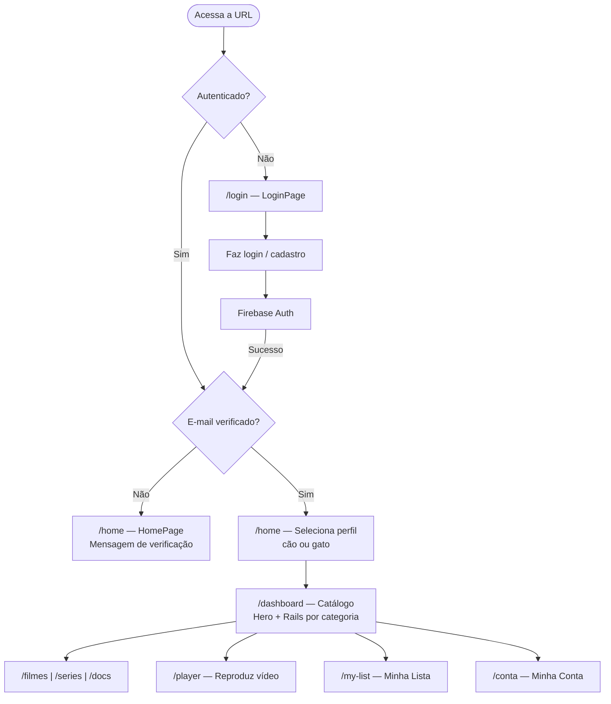
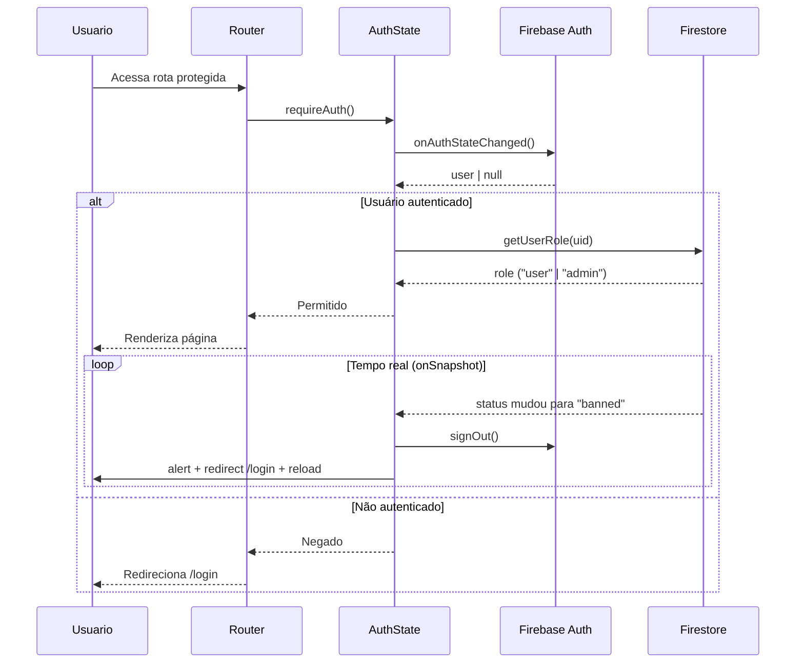

# Arquitetura — Petflix

> Documento técnico de arquitetura da aplicação. Para setup e variáveis de ambiente, veja [SETUP.md](SETUP.md).

---

## Visão de Camadas

```
┌─────────────────────────────────────────────────────────────┐
│                        Browser / SPA                        │
├───────────────────────┬─────────────────────────────────────┤
│     UI (Pages)        │        Components                   │
│  src/pages/**         │  src/components/**                  │
│  Rendem o HTML        │  Reutilizáveis (Card, Rail, Hero)   │
├───────────────────────┴─────────────────────────────────────┤
│                    Estado Global                             │
│          src/state/AuthState.js  AppState.js                │
│  Pub/Sub manual (sem Redux/Zustand/Context pesado)          │
├─────────────────────────────────────────────────────────────┤
│                    Camada de Serviços                        │
│  src/services/*.service.js  src/services/api/**             │
│  Única camada que conversa com Firebase                     │
├─────────────────────────────────────────────────────────────┤
│              Infraestrutura / Backend                        │
│         Firebase Auth          Firestore                    │
└─────────────────────────────────────────────────────────────┘
```

### Regra de ouro

> **Componentes e páginas NÃO importam Firebase diretamente.**
> Toda chamada ao Firebase passa pelo `src/services/`, que isola, trata erros e padroniza os retornos.

---

## Fluxo do Usuário



---

## Fluxo de Autenticação e Banimento



---

## Roteamento (Custom Router)

O Petflix usa um **router próprio** (`src/router/`), sem dependência do React Router.

| Arquivo               | Responsabilidade                                               |
| --------------------- | -------------------------------------------------------------- |
| `router/index.js`     | Loop de navegação, renderização, cleanup                       |
| `router/routes.js`    | Array de rotas com `path`, `component`, `meta`, `middleware[]` |
| `router/navigator.js` | Helper `navigate(path)` para navegação programática            |

### Middlewares de rota

| Guard                  | Arquivo        | Comportamento                                                                                      |
| ---------------------- | -------------- | -------------------------------------------------------------------------------------------------- |
| `requireAuth`          | `routes.js:23` | Aguarda inicialização do Firebase antes de decidir; redireciona para `/login` se não autenticado   |
| `requireEmailVerified` | `routes.js:63` | Redireciona para `/home` se e-mail não verificado                                                  |
| `requireAdmin`         | `routes.js:95` | Verifica `role === 'admin'` no estado ou Firestore; redireciona para `/dashboard` se não for admin |

---

## Esquema do Firestore

### Coleção `users`

```json
{
  "uid": "string (PK — igual ao Firebase Auth UID)",
  "email": "string",
  "role": "user | admin",
  "status": "active | banned",
  "createdAt": "timestamp"
}
```

### Subcoleção `users/{uid}/profiles`

```json
{
  "id": "string (auto-ID do Firestore)",
  "name": "string",
  "species": "dog | cat",
  "avatar": "string (URL)",
  "isDefault": "boolean",
  "createdAt": "timestamp"
}
```

### Coleção `content`

```json
{
  "id": "string (auto-ID do Firestore)",
  "title": "string",
  "description": "string",
  "type": "movie | series | doc",
  "species": "dog | cat",
  "genre": "action | drama | comedy | adventure",
  "videoId": "string (YouTube ID)",
  "image": "string (URL thumbnail)",
  "featured": "boolean",
  "trending": "boolean",
  "original": "boolean",
  "createdAt": "string (ISO 8601)",
  "updatedAt": "string (ISO 8601, opcional)"
}
```

> **Nota histórica**: a coleção anteriormente era chamada `movies`. Foi unificada em `content` para suportar todos os tipos. Referência: `TECHNICAL_DOCS.md` e `src/services/content.service.js`.

---

## Estado Global

O estado é gerenciado com um **padrão pub/sub manual** — sem Redux, Zustand ou React Context pesado.

### `AuthState` (`src/state/AuthState.js`)

```
estado: { user, loading, error, theme }
API:    getState() | setState(updates) | subscribe(callback)
```

- Inicializado em `main.js` via `initAuthState()`
- Sincronizado com `onAuthStateChanged` do Firebase
- Inclui `onSnapshot` listener para banimento em tempo real
- Armazena o usuário serializado também no `localStorage` (chave `currentUser`)

### `AppState` (`src/state/AppState.js`)

- Estado da aplicação (tema ativo do perfil, dados do app)
- Inicializado logo após `AuthState`

---

## Serviços (`src/services/`)

| Serviço                | Coleção Firestore                | Principais funções                                                                                                         |
| ---------------------- | -------------------------------- | -------------------------------------------------------------------------------------------------------------------------- |
| `content.service.js`   | `content`                        | `getAll`, `getBySpecies`, `getFeatured`, `getTrending`, `getOriginals`, `searchContent`, `create`, `update`, `deleteMovie` |
| `list.service.js`      | `users/{uid}/list` (A confirmar) | Favoritos do usuário                                                                                                       |
| `profile.service.js`   | `users/{uid}/profiles`           | CRUD de perfis                                                                                                             |
| `user.service.js`      | `users`                          | `getUserRole`, dados do usuário                                                                                            |
| `youtube.service.js`   | — (API externa)                  | Integração YouTube                                                                                                         |
| `auth/auth.service.js` | — (Firebase Auth)                | `signIn`, `signOut`, `getCurrentUser`                                                                                      |

> `content.service.js` implementa **cache em memória** (`cachedContent`): a primeira leitura busca do Firestore, as seguintes retornam do cache. O cache é invalidado a cada operação de escrita (create/update/delete).

---

## Decisões Técnicas

### Por que Vite?

Vite oferece HMR instantâneo e build otimizado com esbuild/Rollup, ideal para o ciclo de desenvolvimento ágil do projeto. A configuração mínima (`vite.config.js`) reflete a ausência de complexidades desnecessárias.

### Por que Firebase?

Firebase elimina a necessidade de um backend próprio, oferecendo Auth, Firestore e Storage como serviços gerenciados. Para um projeto de portfólio com escala moderada, o plano gratuito (Spark) é suficiente.

### Por que Tailwind CSS v4?

Tailwind v4 usa a nova engine baseada em Lightning CSS com instalação via `@tailwindcss/postcss`, sem arquivo de configuração de conteúdo obrigatório. O projeto usa `postcss.config.js` como ponto de integração.

### Por que custom router?

O router próprio (`src/router/`) foi escolhido para ter controle total sobre o sistema de middlewares (guards), especialmente o `requireAuth` que precisa **aguardar** a inicialização assíncrona do Firebase antes de decidir sobre o redirecionamento.

### Por que ApexCharts?

Utilizado exclusivamente no painel admin (`AdminDashboardPage.js`) para exibir métricas. Escolha baseada na facilidade de integração com JavaScript puro, sem necessidade de wrapper React.
